# madOS Installer - Flujo de Instalación

## Diagrama de Secuencia

```mermaid
sequenceDiagram
    participant U as Usuario
    participant App as madOS Installer (app.py)
    participant Pages as Páginas UI (pages/)
    participant Steps as Pasos Instalación (installer/steps.py)
    participant ConfigScript as config_script.py
    participant System as Sistema/Linux

    Note over U,System: FASE 1: Selección de Disco y Particiones

    U->>App: Selecciona disco (/dev/sda, /dev/nvme0n1)
    App->>App: Guarda install_data["disk"]
    App->>App: notebook.next_page()
    
    Note over App,System: Step 1: Particionado del disco
    App->>Steps: step_partition_disk(disk, separate_home, size)
    Steps->>System: parted mklabel gpt
    Steps->>System: parted mkpart bios_boot 1MiB-2MiB
    Steps->>System: parted set 1 bios_grub on
    Steps->>System: parted mkpart EFI fat32 2MiB-1GiB
    Steps->>System: parted set 2 esp on
    Steps->>System: parted mkpart root ext4 1GiB-50GiB
    Steps->>System: parted mkpart home ext4 50GiB-100% (si separate_home)
    
    rect rgb(240, 248, 255)
        Note over Steps,System: Retorna: (boot_part, root_part, home_part)
        Note over Steps,System: boot_part = sda2 o nvme0n1p2
        Note over Steps,System: root_part = sda3 o nvme0n1p3
        Note over Steps,System: home_part = sda4 o nvme0n1p4 (opcional)
    end

    Note over App,System: Step 2: Formateo de particiones
    App->>Steps: step_format_partitions(boot, root, home)
    Steps->>System: mkfs.fat -F32 /dev/sda2 (EFI)
    Steps->>System: mkfs.ext4 -F /dev/sda3 (root)
    Steps->>System: mkfs.ext4 -F /dev/sda4 (home, si aplica)

    Note over App,System: Step 3: Montaje de archivosistemas
    App->>Steps: step_mount_filesystems(boot, root, home)
    Steps->>System: mount /dev/sda3 /mnt
    Steps->>System: mkdir /mnt/boot
    Steps->>System: mount /dev/sda2 /mnt/boot
    Steps->>System: mkdir /mnt/home && mount /dev/sda4 /mnt/home

    Note over U,System: FASE 2: Copia del Sistema

    App->>Steps: rsync_rootfs_with_progress()
    Steps->>System: rsync -aAXHWS --exclude=... / /mnt/
    Note over Steps,System: Excluye: /dev, /proc, /sys, /tmp, /run, /var/cache, etc.

    Steps->>Steps: post_rsync_cleanup()
    Steps->>System: rm -rf /mnt/usr/lib/python*/test
    Steps->>System: rm -rf /mnt/usr/include
    Steps->>System: rm -rf /mnt/usr/lib/*.a

    App->>Steps: _ensure_kernel_in_target()
    Steps->>System: cp /usr/lib/modules/*/vmlinuz /mnt/boot/vmlinuz-linux

    Note over App,System: Step 4: Generar fstab
    App->>Steps: step_generate_fstab()
    Steps->>System: genfstab -U /mnt > /mnt/etc/fstab

    Note over U,System: FASE 3: Configuración del Sistema

    App->>ConfigScript: build_config_script(data)
    rect rgb(240, 255, 240)
        Note over ConfigScript: Calcula particiones dinámicamente
        Note over ConfigScript: disk = /dev/sda → root_part = /dev/sda3
        Note over ConfigScript: disk = /dev/nvme0n1 → root_part = /dev/nvme0n1p3
    end
    ConfigScript-->>App: Retorna script bash completo

    App->>System: Escribe /mnt/root/configure.sh
    App->>Steps: step_copy_live_files()
    Steps->>System: Copia Plymouth themes, scripts, desktop files

    Note over App,System: Step 5: Ejecutar configure.sh en chroot
    App->>Steps: run_chroot_with_progress("/mnt/root/configure.sh")
    Steps->>System: arch-chroot /mnt /root/configure.sh
    
    rect rgb(255, 240, 240)
        Note over ConfigScript,System: ═══════════════════════════════════════
        Note over ConfigScript,System: EJECUCIÓN DE configure.sh (dentro del chroot)
        Note over ConfigScript,System: ═══════════════════════════════════════
    end

    ConfigScript->>System: [PROGRESS 1/8] timezone + locale
    System->>System: ln -sf /usr/share/zoneinfo/Europe/Madrid /etc/localtime
    System->>System: locale-gen
    System->>System: echo "LANG=es_ES.UTF-8" > /etc/locale.conf

    ConfigScript->>System: [PROGRESS 2/8] Crear usuario
    System->>System: useradd -m -G wheel,audio,video,storage -s /usr/bin/zsh testuser
    System->>System: echo 'testuser:testpass123' | chpasswd
    System->>System: userdel -r mados (limpia usuario live)
    System->>System: systemctl disable livecd-*.service

    ConfigScript->>System: [PROGRESS 3/8] Instalar GRUB
    System->>System: Verifica /sys/firmware/efi exists
    
    alt Modo UEFI
        System->>System: grub-install --target=x86_64-efi --efi-directory=/boot --bootloader-id=madOS --recheck
        System->>System: grub-install --target=x86_64-efi --efi-directory=/boot --removable --recheck
    else Modo BIOS
        System->>System: BASE_DISK=$(echo "$disk" | sed 's/[0-9]*$//')
        System->>System: grub-install --target=i386-pc --recheck "$BASE_DISK"
    end

    ConfigScript->>System: [PROGRESS 4/8] Configurar GRUB
    System->>System: sed -i 's/GRUB_CMDLINE_LINUX="" /GRUB_CMDLINE_LINUX="zswap.enabled=0 splash quiet"/' /etc/default/grub
    System->>System: sed -i 's/GRUB_DISTRIBUTOR="Arch"/GRUB_DISTRIBUTOR="madOS"/' /etc/default/grub
    
    rect rgb(200, 255, 200)
        Note over System: ✓ CORREGIDO - Partición dinámica
        System->>System: ROOT_UUID=$(blkid -s UUID -o value $root_part 2>/dev/null || echo "")
        Note over System: Donde root_part = /dev/sda3 o /dev/nvme0n1p3
    end
    
    System->>System: Crea /boot/grub/custom/mados.cfg con el UUID

    ConfigScript->>System: [PROGRESS 5/8] Plymouth
    System->>System: mkdir /usr/share/plymouth/themes/mados
    System->>System: Configura theme mados.plymouth y mados.script

    ConfigScript->>System: [PROGRESS 6/8] Initramfs
    System->>System: rm -f /etc/mkinitcpio.conf.d/archiso.conf
    System->>System: mkinitcpio -P

    ConfigScript->>System: [PROGRESS 7/8] Habilitar servicios
    System->>System: systemctl enable NetworkManager
    System->>System: systemctl enable greetd
    System->>System: systemctl enable bluetooth
    System->>System: systemctl enable iwd

    ConfigScript->>System: [PROGRESS 8/8] Configuración final
    System->>System: Crea /etc/os-release (madOS branding)
    System->>System: Configura /etc/NetworkManager/conf.d/wifi-backend=iwd
    System->>System: Configura /etc/sysctl.d/99-extreme-low-ram.conf
    System->>System: Configura /etc/systemd/zram-generator.conf
    System->>System: Configura /etc/greetd/config.toml
    System->>System: Copia configs a /home/testuser/.config/

    Note over U,System: FASE 4: Limpieza Final

    Steps->>System: rm /mnt/root/configure.sh
    Steps->>System: sync && umount -R /mnt
    
    App->>U: ¡Instalación completa!
```



## Particionamiento del Disco

### Esquema de particiones (discos SATA/HDD: sda, SSD: nvme, etc.)

```
/dev/sda                      → Disco completo
├─ /dev/sda1 (1MB)            → BIOS Boot (bios_grub flag)
├─ /dev/sda2 (1GB)            → EFI System Partition (esp flag, FAT32)
├─ /dev/sda3 (50GB)           → Root (/) (ext4)
└─ /dev/sda4 (resto)          → Home (/home) (ext4) [opcional]

/dev/nvme0n1                  → Disco NVMe
├─ /dev/nvme0n1p1 (1MB)       → BIOS Boot
├─ /dev/nvme0n1p2 (1GB)       → EFI
├─ /dev/nvme0n1p3 (50GB)      → Root
└─ /dev/nvme0n1p4 (resto)     → Home [opcional]
```

## Correcciones Aplicadas

### 1. Partición raíz dinámica (ARREGLADO)

**Problema original:**
```bash
ROOT_UUID=$(blkid -s UUID -o value /dev/sda3 2>/dev/null || echo "")
```

**Solución aplicada en `config_script.py`:**
```python
def _get_partition_prefix(disk):
    """Get partition prefix (nvme/mmcblk use 'p' separator)"""
    return f"{disk}p" if "nvme" in disk or "mmcblk" in disk else disk

# En build_config_script():
part_prefix = _get_partition_prefix(disk)
root_part = f"{part_prefix}3"  # Dinámico: sda3 o nvme0n1p3

# En el script generado:
ROOT_UUID=$(blkid -s UUID -o value {root_part} 2>/dev/null || echo "")
```

### 2. Agregado rebuild de initramfs (ARREGLADO)

**Problema:** El initramfs no se regeneraba después de limpiar config de archiso.

**Solución:**
```bash
echo '[PROGRESS 6/8] Rebuilding initramfs...'
rm -f /etc/mkinitcpio.conf.d/archiso.conf
mkinitcpio -P
```

### Tipos de disco soportados

| Tipo de disco | Disco | Partición raíz |
|---------------|-------|----------------|
| SATA/HDD | `/dev/sda` | `/dev/sda3` |
| SATA secundario | `/dev/sdb` | `/dev/sdb3` |
| NVMe | `/dev/nvme0n1` | `/dev/nvme0n1p3` |
| NVMe secundario | `/dev/nvme1n1` | `/dev/nvme1n1p3` |
| eMMC | `/dev/mmcblk0` | `/dev/mmcblk0p3` |