# madOS Installer - Installation Flow

## Overview

The installer uses **Btrfs with subvolumes** for OTA (Over-The-Air) update support. This enables atomic updates with automatic rollback capability.

## Partition Scheme

```
/dev/sda (SATA/HDD)           /dev/nvme0n1 (NVMe)
├─ sda1 (1MB) BIOS Boot        ├─ nvme0n1p1 (1MB) BIOS Boot
├─ sda2 (1GB) EFI              ├─ nvme0n1p2 (1GB) EFI
└─ sda3 (rest) Root (Btrfs)    └─ nvme0n1p3 (rest) Root (Btrfs)
```

## Step 1: Disk Selection

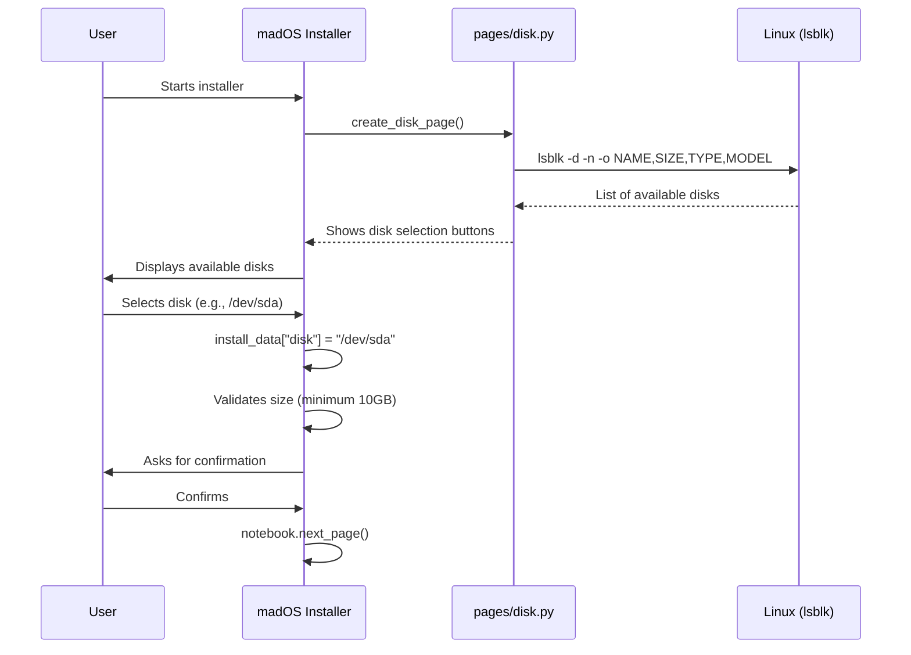

## Step 2: Partitioning (Btrfs with Subvolumes)

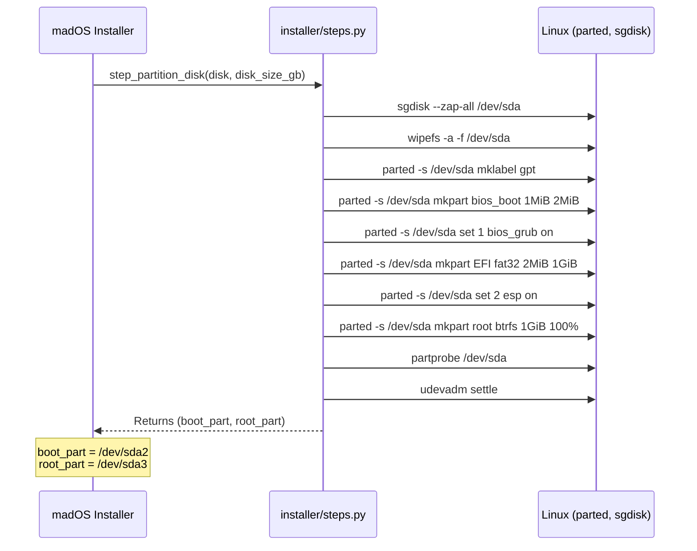

## Step 3: Format Partitions

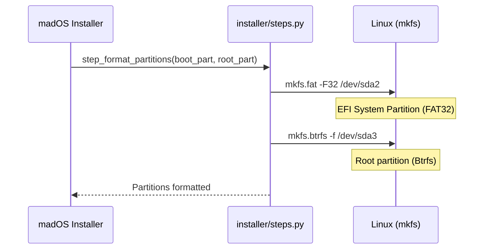

## Step 4: Create Btrfs Subvolumes

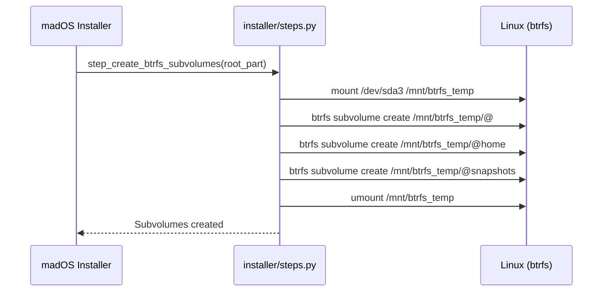

## Step 5: Mount Filesystems

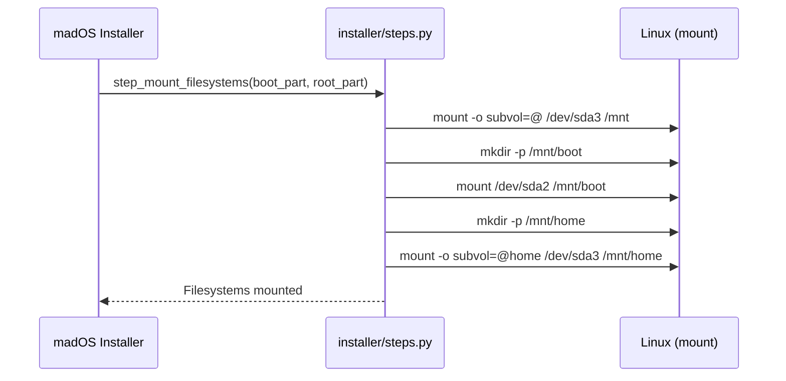

## Step 6: System Copy (rsync)

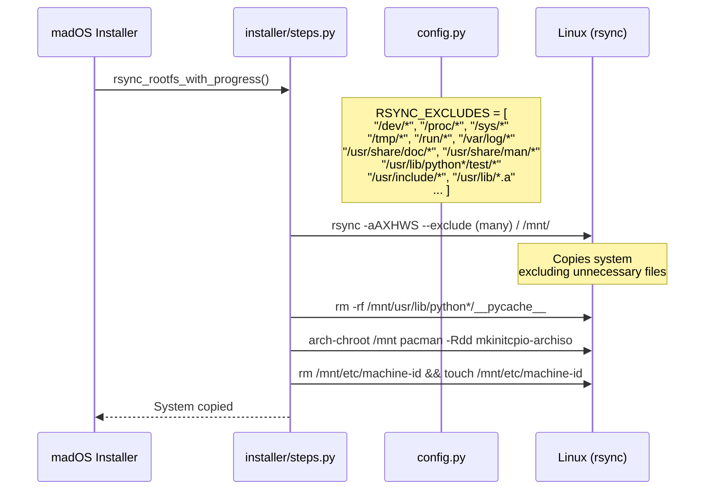

## Step 7: Generate fstab (with Btrfs subvolumes)

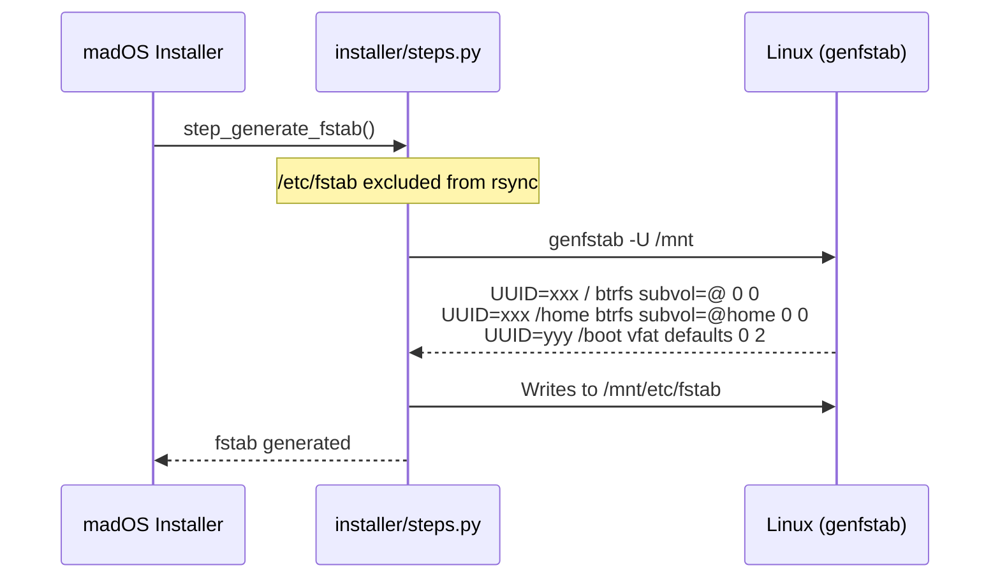

## Step 8: Configure Snapper

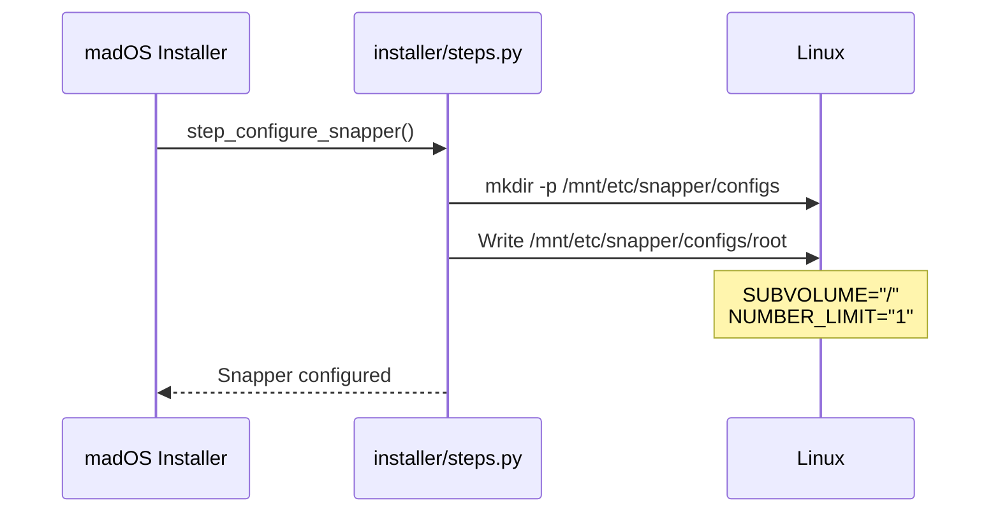

## Step 9: Generate Configuration Script

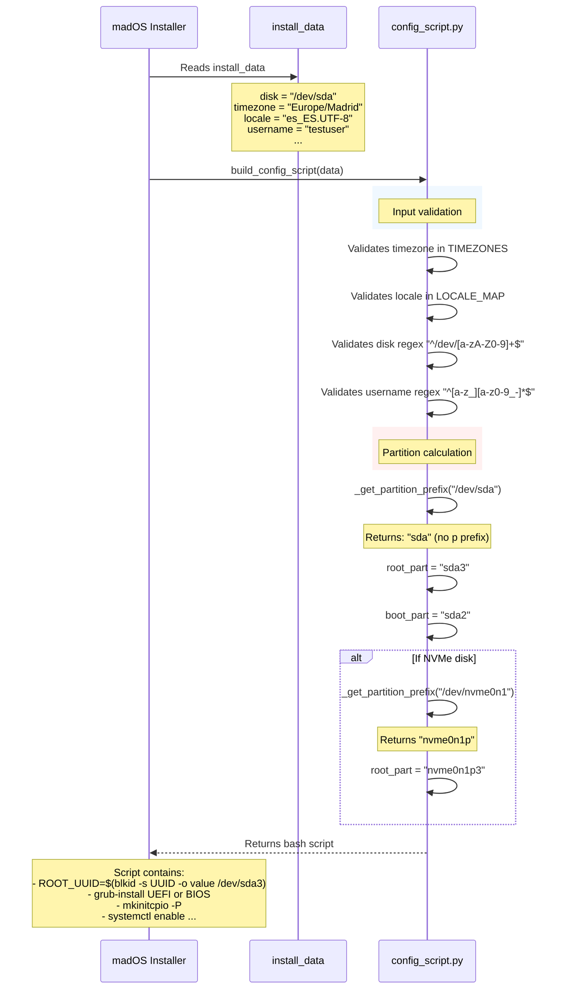

## Step 10: Execute configure.sh in chroot (Part 1/2)

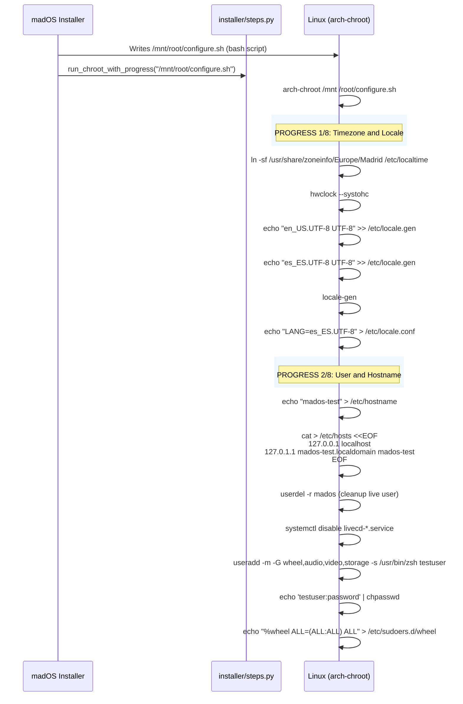

## Step 10: Execute configure.sh in chroot (Part 2/2 - GRUB)

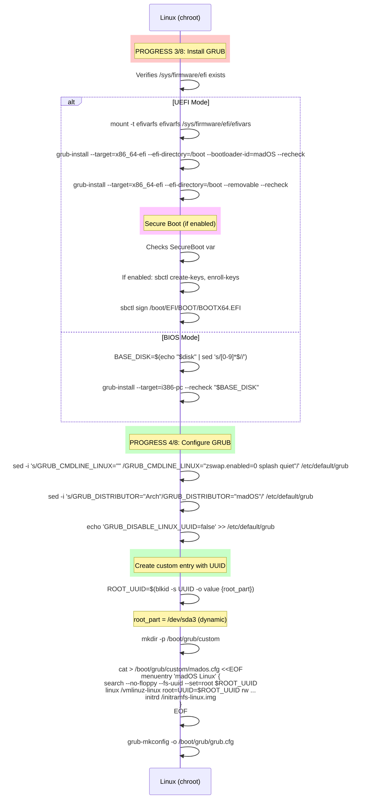

## Step 10 (continued): Plymouth, Initramfs, Services

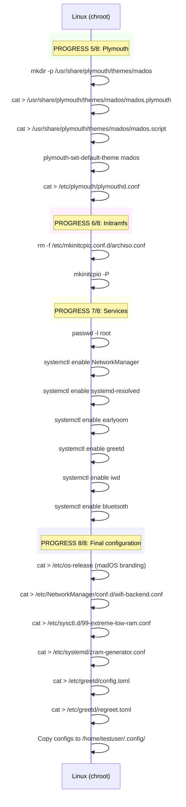

## Step 11: Final Cleanup

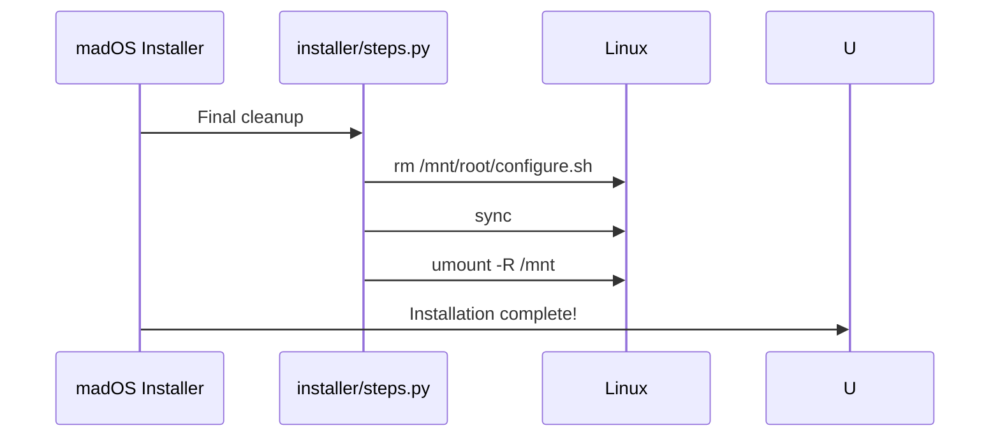

## Dynamic Partition Calculation

| Variable | SATA | NVMe |
|----------|------|------|
| `disk` | `/dev/sda` | `/dev/nvme0n1` |
| `part_prefix` | `sda` | `nvme0n1p` |
| `boot_part` | `sda2` | `nvme0n1p2` |
| `root_part` | `sda3` | `nvme0n1p3` |

## Critical Process Points

1. **Partitioning**: Creates BIOS boot, EFI, root (Btrfs)
2. **Formatting**: EFI = FAT32, root = Btrfs
3. **Subvolumes**: @, @home, @snapshots created on Btrfs
4. **Mounting**: EFI at /boot, root with subvol=@, home with subvol=@home
5. **fstab**: Generated with genfstab -U (UUIDs) and subvol mount options
6. **Snapper**: Configured for automatic snapshots
7. **GRUB**:
   - UEFI: --efi-directory=/boot --removable
   - BIOS: --target=i386-pc --recheck $BASE_DISK
   - Custom entry with dynamic UUID
8. **initramfs**: mkinitcpio -P (rebuilt)
9. **Services**: NetworkManager, greetd, iwd, bluetooth
