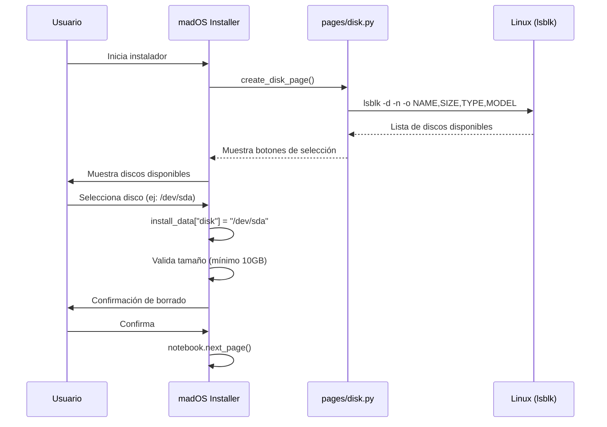
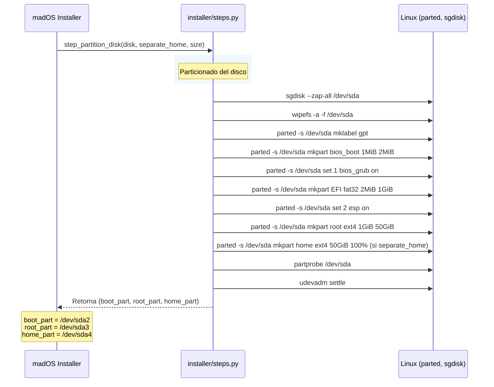
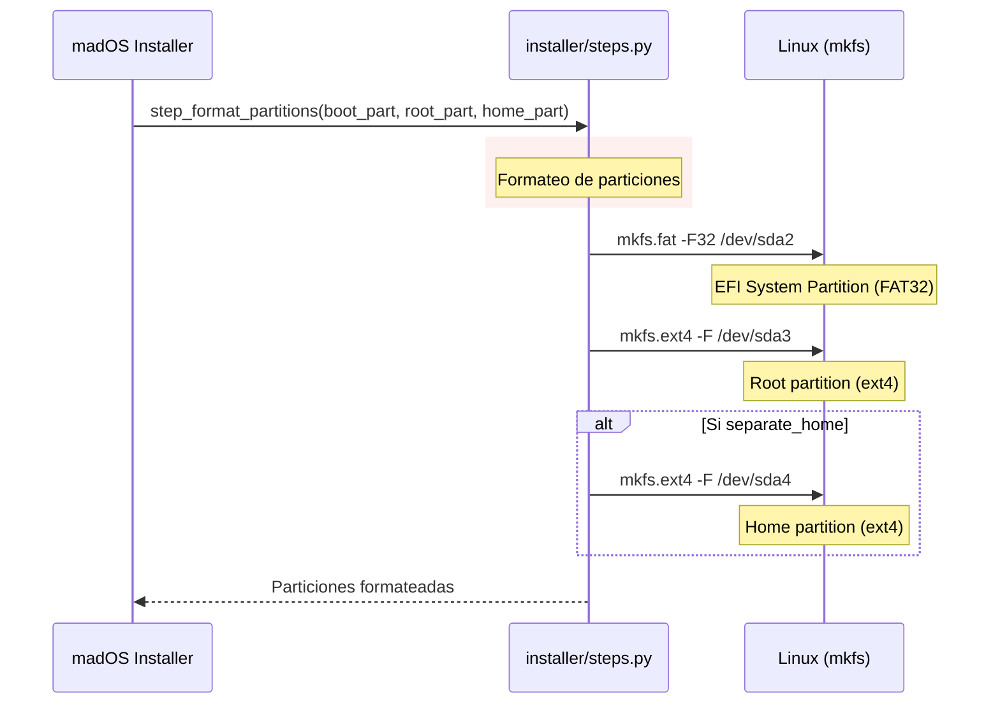
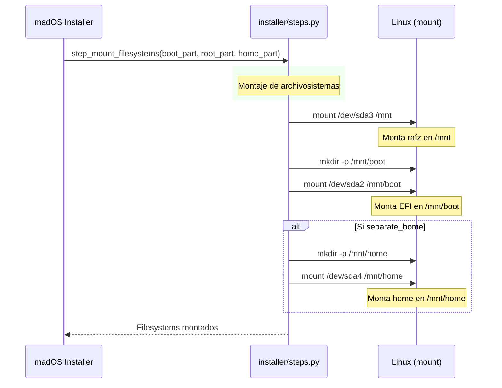
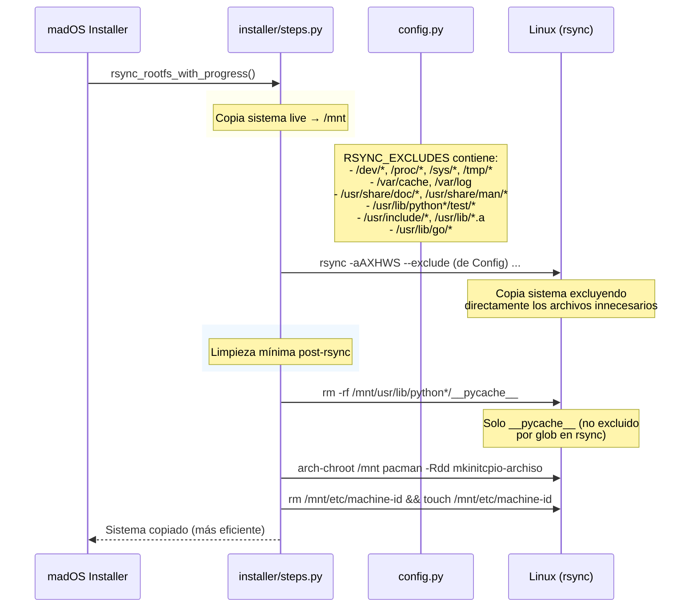
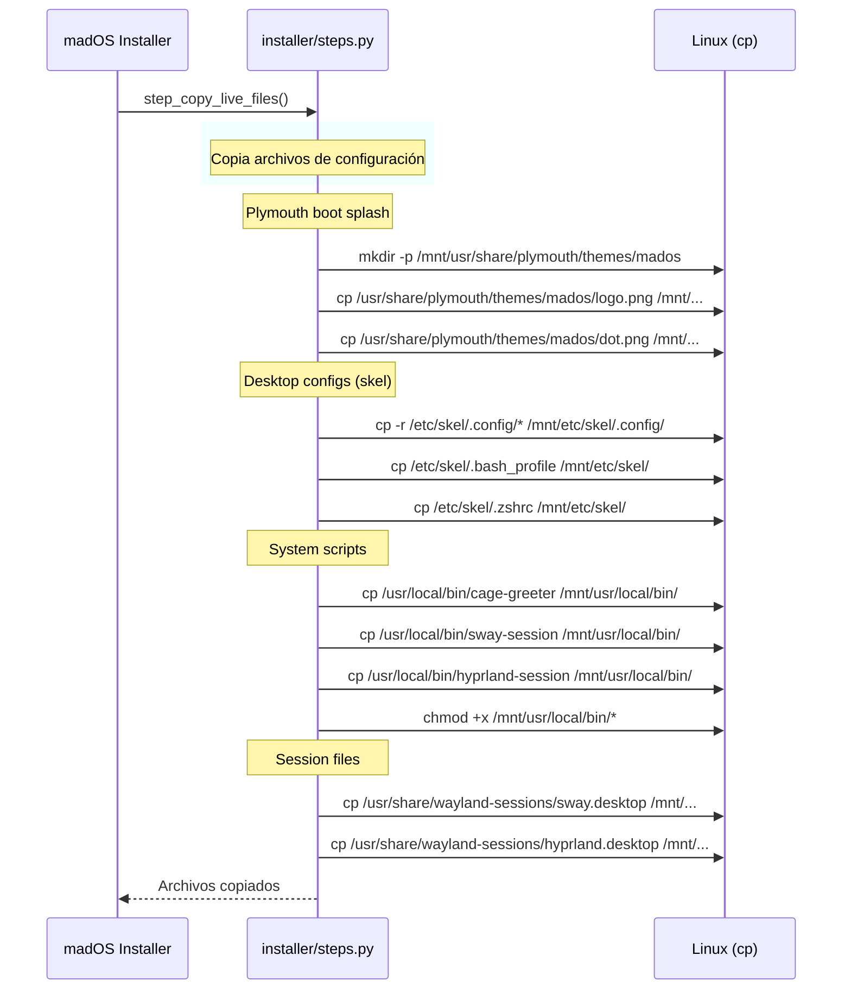
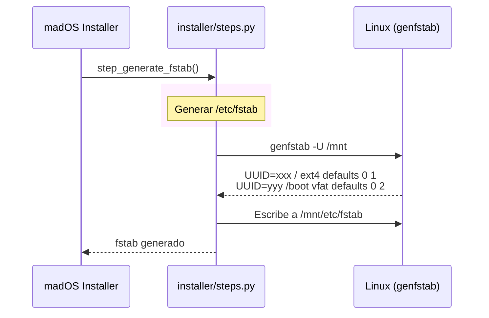
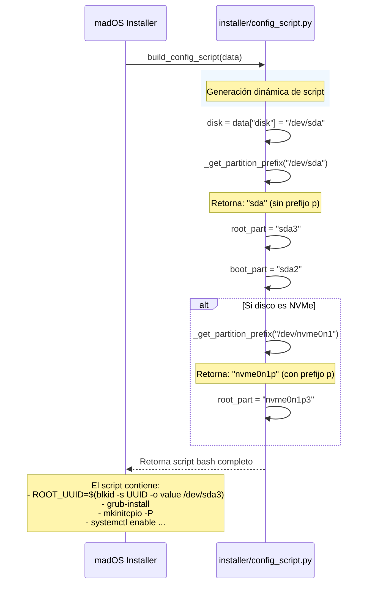
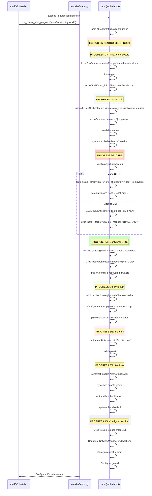

# madOS Installer - Flujo de Instalación

## Paso 1: Selección de Disco



## Paso 2: Particionamiento



## Paso 3: Formateo de Particiones



## Paso 4: Montaje de Filesystems



## Paso 5: Copia del Sistema (rsync)



## Paso 6: Copia de archivos adicionales



## Paso 7: Generar fstab



## Paso 8: Generación del script de configuración



## Paso 9: Ejecutar configure.sh en chroot



## Paso 10: Limpieza final


## Resumen del Particionamiento

```
/dev/sda (SATA/HDD)           /dev/nvme0n1 (NVMe)
├─ sda1 (1MB) BIOS Boot        ├─ nvme0n1p1 (1MB) BIOS Boot
├─ sda2 (1GB) EFI              ├─ nvme0n1p2 (1GB) EFI
├─ sda3 (50GB) Root (/)        ├─ nvme0n1p3 (50GB) Root (/)
└─ sda4 (resto) Home (/home)   └─ nvme0n1p4 (resto) Home (/home)
```

## Cálculo Dinámico de Particiones

| Variable | SATA | NVMe |
|----------|------|------|
| `disk` | `/dev/sda` | `/dev/nvme0n1` |
| `part_prefix` | `sda` | `nvme0n1p` |
| `boot_part` | `sda2` | `nvme0n1p2` |
| `root_part` | `sda3` | `nvme0n1p3` |
| `home_part` | `sda4` | `nvme0n1p4` |